# Bloque 01 · Elementos de hardware

**UP01 · Mantenimiento básico de equipos**
Módulo de Ofimática · CFGS Documentación y Administración Sanitarias

---

## 1 · ¿Qué es el hardware?

El **hardware** es el conjunto de componentes físicos de un sistema informático, es decir, todas las partes que podemos **ver y tocar**.

Incluye desde los elementos internos del ordenador (procesador, memoria o disco duro) hasta dispositivos externos como el teclado, el monitor o la impresora.

> 💡 **Idea clave:** si se puede tocar, es hardware. Es la parte física del sistema informático.

> 🏥 **Aplicación en entornos sanitarios:** el hardware permite ejecutar aplicaciones esenciales para la gestión de historias clínicas electrónicas, la gestión de citas, la atención al paciente, la comunicación interna y el almacenamiento seguro de información.

> ✍️ **Ejemplo práctico:** el ordenador de un mostrador de admisión, el lector de tarjetas sanitarias y la impresora de etiquetas son hardware.

> ❓ **Pregunta para reflexionar:** ¿podría funcionar un ordenador únicamente con software?

> 📌 **Resumen:** hardware = componentes físicos y tangibles (internos y externos) que sostienen todo el sistema informático.

<div class="image-grid image-grid--2">
<figure class="image-card">
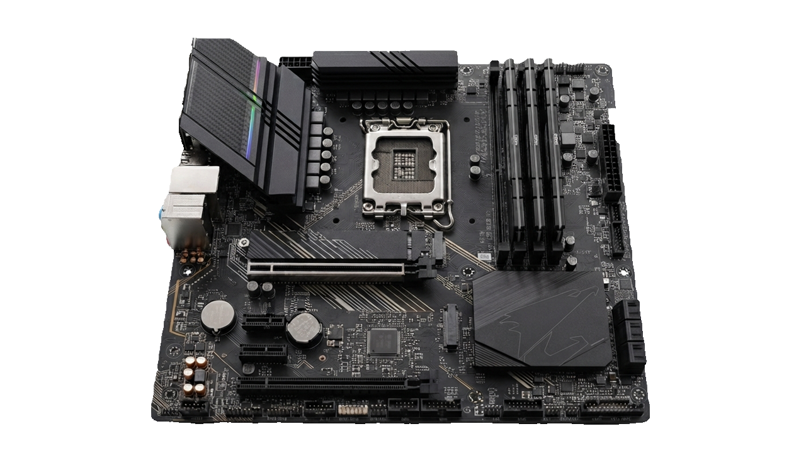
<figcaption>Placa base</figcaption>
</figure>
<figure class="image-card">
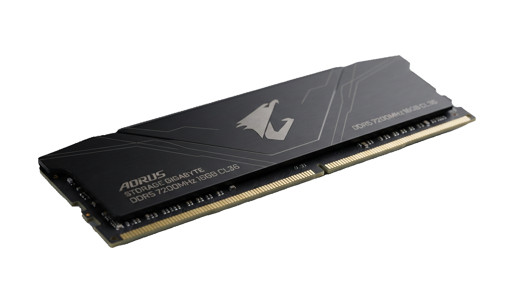
<figcaption>Memoria RAM</figcaption>
</figure>
</div>

> 🧩 **Cuestionario en Aules:** tras repasar este apartado, realiza el cuestionario **«HW-01 ¿Qué es el hardware?»** en la plataforma Aules. Las preguntas son aleatorias y se guardará tu mejor nota.

---

## 2 · Componentes esenciales

Los **componentes esenciales** son aquellos que permiten el funcionamiento básico de cualquier ordenador.

### 2.1 · Placa base

La **placa base** es la placa principal del ordenador. Sobre ella se conectan el resto de componentes y se establece la comunicación entre todos ellos.

- **Función:** conectar todos los componentes y permitir la comunicación entre procesador, memoria, almacenamiento y periféricos.
- **Ubicación:** ocupa gran parte del interior de la carcasa.
- **Curiosidad:** algunas placas incorporan indicadores LED que ayudan a localizar averías durante el arranque.

> 🏥 **Aplicación en entornos sanitarios:** permite la comunicación entre todos los componentes de los equipos utilizados en admisión, consultas médicas, laboratorios y servicios administrativos.

> ❓ **Pregunta para reflexionar:** ¿qué podría ocurrir en un centro sanitario si falla la placa base de un ordenador?
> **Respuesta orientativa:** el equipo dejaría de funcionar correctamente, impidiendo el acceso a citas, historiales clínicos y aplicaciones de gestión.

### 2.2 · Fuente de alimentación

La **fuente de alimentación** convierte la corriente eléctrica procedente de la red en los diferentes **voltajes** que necesitan los componentes internos del ordenador.

- **Función:** suministrar energía eléctrica estable y proteger frente a algunas variaciones de tensión.
- **Ubicación:** habitualmente en la parte superior o inferior de la caja del ordenador.
- **Curiosidad:** una fuente de mala calidad puede provocar averías en otros componentes.

> 🏥 **Aplicación en entornos sanitarios:** proporciona energía a los equipos que gestionan historias clínicas, citas médicas y documentación sanitaria.

> ❓ **Pregunta para reflexionar:** ¿por qué es importante que la fuente de alimentación sea fiable en un centro sanitario?
> **Respuesta orientativa:** porque una avería puede provocar apagados inesperados, pérdida de información o interrupción de servicios.

> 📌 **Resumen:** placa base (comunica todo) + fuente de alimentación (da energía estable) son la base física de cualquier equipo.

<div class="image-grid image-grid--2">
<figure class="image-card">

<figcaption>Placa base</figcaption>
</figure>
<figure class="image-card">
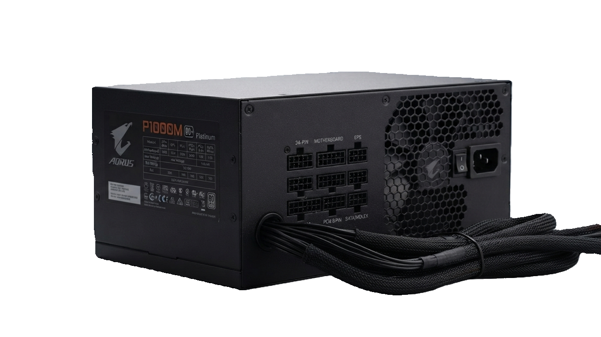
<figcaption>Fuente de alimentación</figcaption>
</figure>
</div>

> 🧩 **Cuestionario en Aules:** tras repasar este apartado, realiza el cuestionario **«HW-02 Componentes esenciales»** en Aules. Las preguntas son aleatorias y se guardará tu mejor nota.

---

## 3 · Hardware de procesamiento

Los componentes de procesamiento son los encargados de **ejecutar instrucciones y realizar cálculos**.

### 3.1 · Procesador (CPU)

La **CPU** (Central Processing Unit) se considera el **cerebro del ordenador**.

- **Función:** ejecutar instrucciones, realizar cálculos y coordinar el funcionamiento del sistema.
- **Ubicación:** se instala en un zócalo específico de la placa base, cubierto por un disipador y un ventilador.
- **Curiosidad:** los procesadores actuales contienen miles de millones de transistores.

> 🏥 **Aplicación en entornos sanitarios:** ejecuta programas de gestión de pacientes, historia clínica electrónica, facturación sanitaria y aplicaciones de ofimática.

> ❓ **Pregunta para reflexionar:** ¿qué consecuencias tendría usar un equipo con una CPU poco potente para gestionar cientos de pacientes al día?
> **Respuesta orientativa:** las aplicaciones funcionarían más lentamente, aumentando los tiempos de espera y reduciendo la productividad.

### 3.2 · Tarjeta gráfica (GPU)

La **GPU** (Graphics Processing Unit) es el componente encargado de **procesar imágenes y gráficos**.

- **Función:** generar imágenes y acelerar cálculos paralelos especializados.
- **Ubicación:** se conecta a una ranura PCIe de la placa base.
- **Curiosidad:** actualmente se utiliza también en inteligencia artificial.

> 🏥 **Aplicación en entornos sanitarios:** es fundamental en radiología, diagnóstico por imagen y visualización de TAC o resonancias magnéticas.

> ❓ **Pregunta para reflexionar:** ¿por qué es importante una GPU potente en radiología?
> **Respuesta orientativa:** porque permite visualizar imágenes médicas de alta resolución de forma rápida y precisa.

> 📌 **Resumen:** la CPU ejecuta y calcula; la GPU genera y acelera imágenes. Ambas procesan información.

<div class="image-grid image-grid--2">
<figure class="image-card">
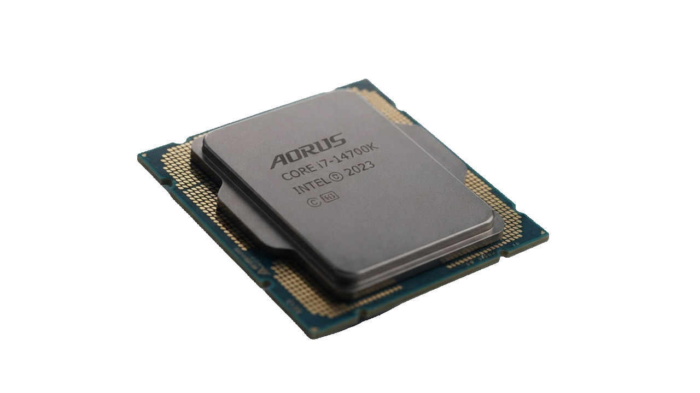
<figcaption>Procesador (CPU)</figcaption>
</figure>
<figure class="image-card">
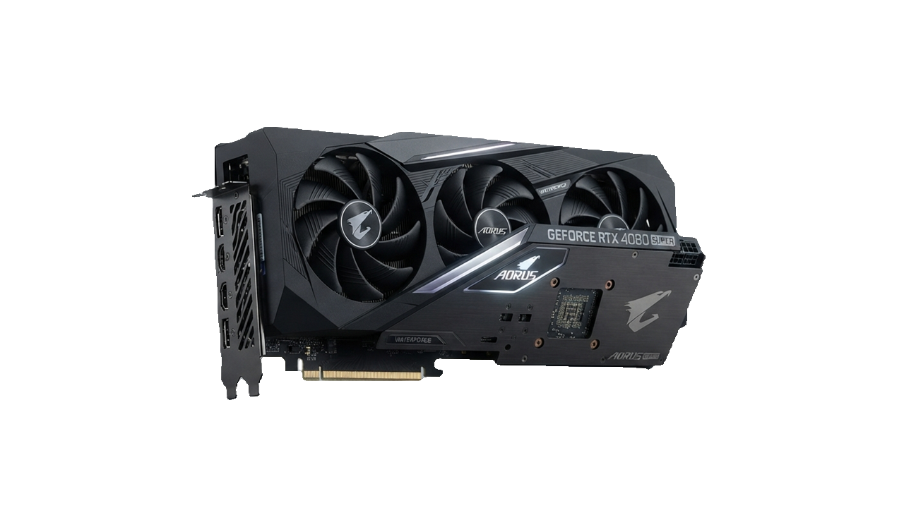
<figcaption>Tarjeta gráfica (GPU)</figcaption>
</figure>
</div>

> 🧩 **Cuestionario en Aules:** tras repasar este apartado, realiza el cuestionario **«HW-03 Hardware de procesamiento»** en Aules. Las preguntas son aleatorias y se guardará tu mejor nota.

---

## 4 · Hardware de almacenamiento

Estos componentes permiten **guardar información** de manera temporal o permanente.

### 4.1 · Disco duro (HDD)

El **HDD** (Hard Disk Drive) utiliza **discos magnéticos** para almacenar información.

- **Función:** guardar datos de forma permanente.
- **Ubicación:** se instala en una bahía de almacenamiento y se conecta mediante cables SATA.
- **Tipo:** almacenamiento permanente (no volátil).
- **Curiosidad:** permite almacenar mucha información a un coste reducido.

> 🏥 **Aplicación en entornos sanitarios:** se utiliza para copias de seguridad, archivos históricos y grandes volúmenes de documentación sanitaria.

> ❓ **Pregunta para reflexionar:** ¿qué tipo de información sanitaria es más adecuado almacenar en un HDD?
> **Respuesta orientativa:** copias de seguridad y documentos que no necesitan consultarse continuamente.

### 4.2 · Unidad de estado sólido (SSD)

El **SSD** (Solid State Drive) utiliza **memoria flash** para almacenar información.

- **Función:** guardar de manera permanente el sistema operativo, los programas y los archivos.
- **Ubicación:** puede conectarse mediante SATA o directamente a una ranura M.2.
- **Tipo:** almacenamiento permanente (no volátil).
- **Curiosidad:** no tiene partes móviles, por lo que es más rápido y resistente.

> 🏥 **Aplicación en entornos sanitarios:** permite acceder rápidamente a historiales clínicos y aplicaciones sanitarias.

> ❓ **Pregunta para reflexionar:** ¿qué consecuencias tendría para la atención al paciente que el acceso a las historias clínicas fuera muy lento?
> **Respuesta orientativa:** retrasos en consultas, gestiones y toma de decisiones.

> 📌 **Resumen:** HDD (mucho espacio, menor coste) frente a SSD (más rápido, sin partes móviles). Ambos guardan datos de forma permanente.

<div class="image-grid image-grid--2">
<figure class="image-card">
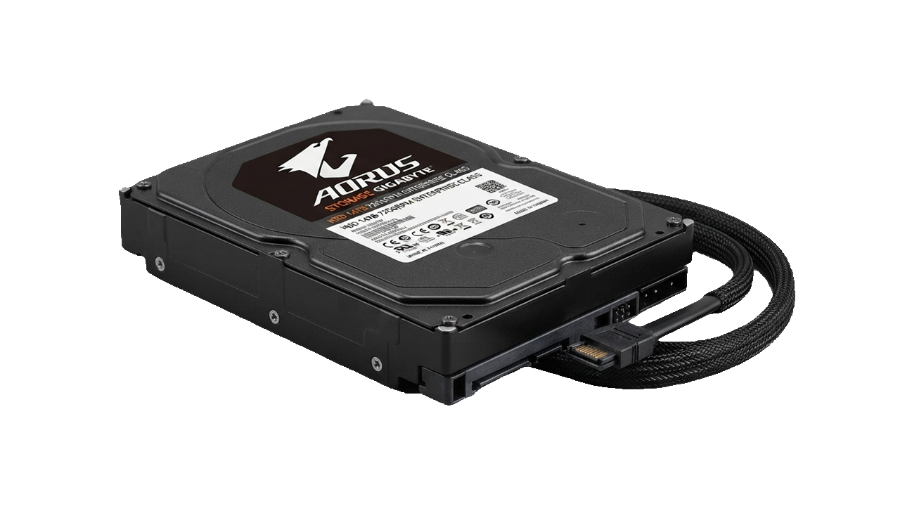
<figcaption>Disco duro (HDD)</figcaption>
</figure>
<figure class="image-card">
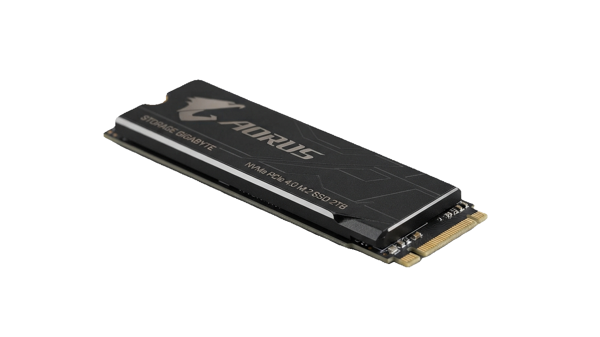
<figcaption>Unidad de estado sólido (SSD)</figcaption>
</figure>
</div>

> 🧩 **Cuestionario en Aules:** tras repasar este apartado, realiza el cuestionario **«HW-04 Hardware de almacenamiento»** en Aules. Las preguntas son aleatorias y se guardará tu mejor nota.

---

## 5 · Tipos de memoria

Además del almacenamiento permanente (HDD y SSD), un ordenador utiliza **diferentes tipos de memoria** para arrancar el sistema, ejecutar programas, almacenar información y mejorar el rendimiento. Cada tipo tiene una función específica.

### 5.1 · Memoria RAM

La memoria **RAM** (Random Access Memory) es la **memoria principal** del ordenador: almacena temporalmente los datos y programas que se están utilizando en cada momento.

- **Tipo:** memoria principal **volátil** (su contenido desaparece al apagar el ordenador).
- **Función:** guardar los datos de trabajo de las aplicaciones abiertas, permitir ejecutar varios programas a la vez y facilitar el acceso rápido a la información.
- **Ubicación:** módulos específicos conectados a la placa base.
- **Curiosidad:** si la RAM se llena, el sistema puede usar memoria virtual, que es más lenta.

> 🏥 **Aplicación en entornos sanitarios:** permite utilizar a la vez la historia clínica electrónica, el correo corporativo, las aplicaciones de gestión sanitaria y las herramientas ofimáticas.

> ❓ **Pregunta para reflexionar:** ¿qué ocurre si un ordenador tiene poca RAM y se abren muchas aplicaciones a la vez?
> **Respuesta orientativa:** el sistema se vuelve más lento porque tiene dificultades para almacenar temporalmente toda la información necesaria.

### 5.2 · Memoria ROM

La memoria **ROM** (Read-Only Memory) almacena las **instrucciones básicas** necesarias para iniciar el ordenador.

- **Tipo:** memoria permanente **no volátil**.
- **Función:** almacenar el firmware del sistema (UEFI) y permitir el arranque.
- **Ubicación:** integrada en un chip de la placa base.
- **Curiosidad:** actualmente contiene el firmware UEFI, sucesor de la antigua BIOS.

> 🏥 **Aplicación en entornos sanitarios:** garantiza el arranque correcto de los equipos utilizados en hospitales, centros de salud y consultas.

> ❓ **Pregunta para reflexionar:** ¿qué ocurriría si la memoria ROM estuviera dañada?
> **Respuesta orientativa:** el ordenador podría no iniciar correctamente y no sería posible acceder a las aplicaciones sanitarias.

### 5.3 · Memoria caché

La memoria **caché** es una memoria **muy rápida integrada en el procesador**.

- **Tipo:** memoria ultrarrápida de apoyo al procesador.
- **Función:** almacenar temporalmente los datos más utilizados por la CPU y reducir los tiempos de acceso.
- **Características:** más rápida que la RAM, de poca capacidad y funciona automáticamente.

> 🏥 **Aplicación en entornos sanitarios:** acelera el acceso a la información utilizada continuamente por las aplicaciones sanitarias.

### 5.4 · Memoria virtual

La memoria **virtual** es un **espacio del disco duro o SSD** que el sistema operativo utiliza como apoyo cuando la memoria RAM es insuficiente.

- **Tipo:** memoria **lógica** gestionada por el sistema operativo (no es física).
- **Características:** es más lenta que la RAM y se gestiona automáticamente.

> 🏥 **Aplicación en entornos sanitarios:** permite mantener abiertas varias aplicaciones cuando la memoria RAM disponible resulta insuficiente.

### 5.5 · Otros tipos de memoria

- **Memoria Flash:** memoria no volátil usada en pendrives, tarjetas SD y unidades SSD. En sanidad, para copias de seguridad y dispositivos portátiles.
- **Memoria CMOS:** pequeña memoria que guarda fecha, hora y parámetros del hardware. Mantiene la configuración básica con el equipo apagado.
- **Memoria VRAM:** memoria integrada en la tarjeta gráfica para almacenar imágenes. Fundamental para la visualización de imágenes médicas en radiología, TAC y resonancias.

> 💡 **Idea clave:** RAM es la mesa de trabajo (rápida, volátil); ROM arranca el sistema; caché acelera a la CPU; la virtual ayuda cuando la RAM falla.

> 📌 **Resumen:** ningún ordenador funciona sin memoria: RAM (trabajo), ROM (arranque), caché (velocidad), virtual (apoyo) y flash/CMOS/VRAM para funciones específicas.

<div class="image-grid">
<figure class="image-card">

<figcaption>Memoria RAM</figcaption>
</figure>
<figure class="image-card">
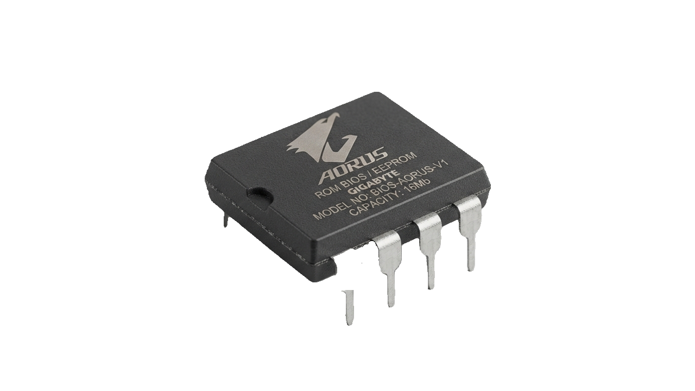
<figcaption>Memoria ROM</figcaption>
</figure>
<figure class="image-card">
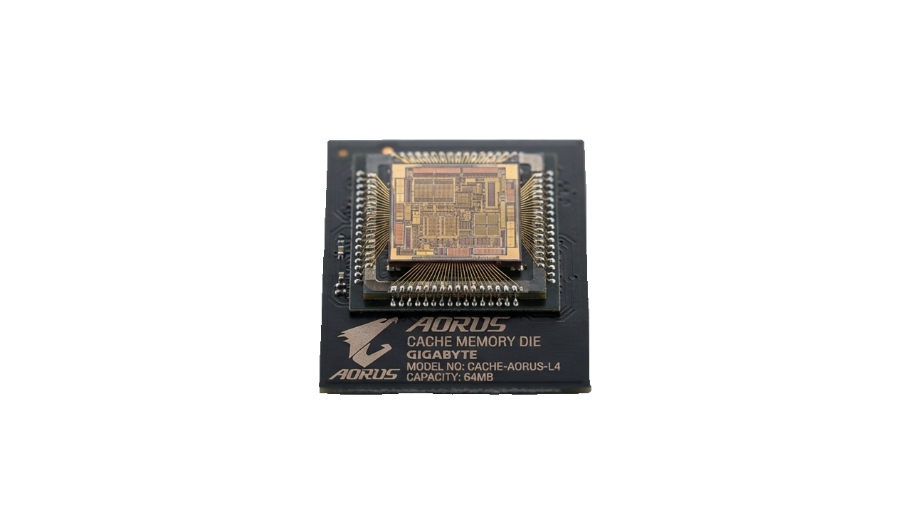
<figcaption>Memoria caché</figcaption>
</figure>
<figure class="image-card">
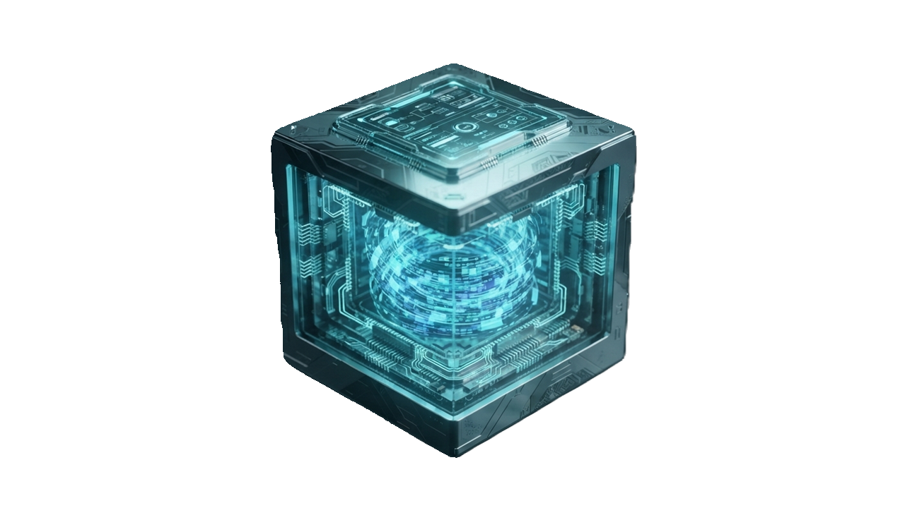
<figcaption>Memoria virtual</figcaption>
</figure>
<figure class="image-card">
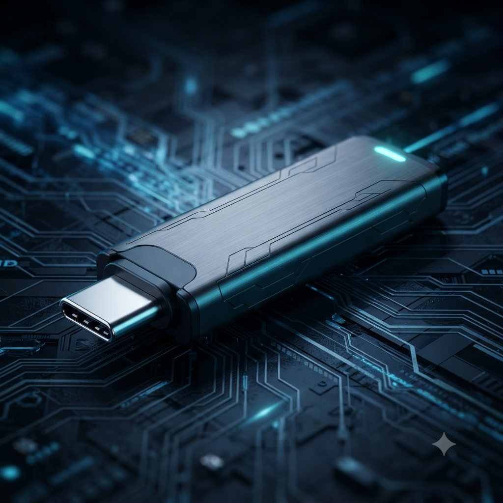
<figcaption>Memoria flash</figcaption>
</figure>
<figure class="image-card">
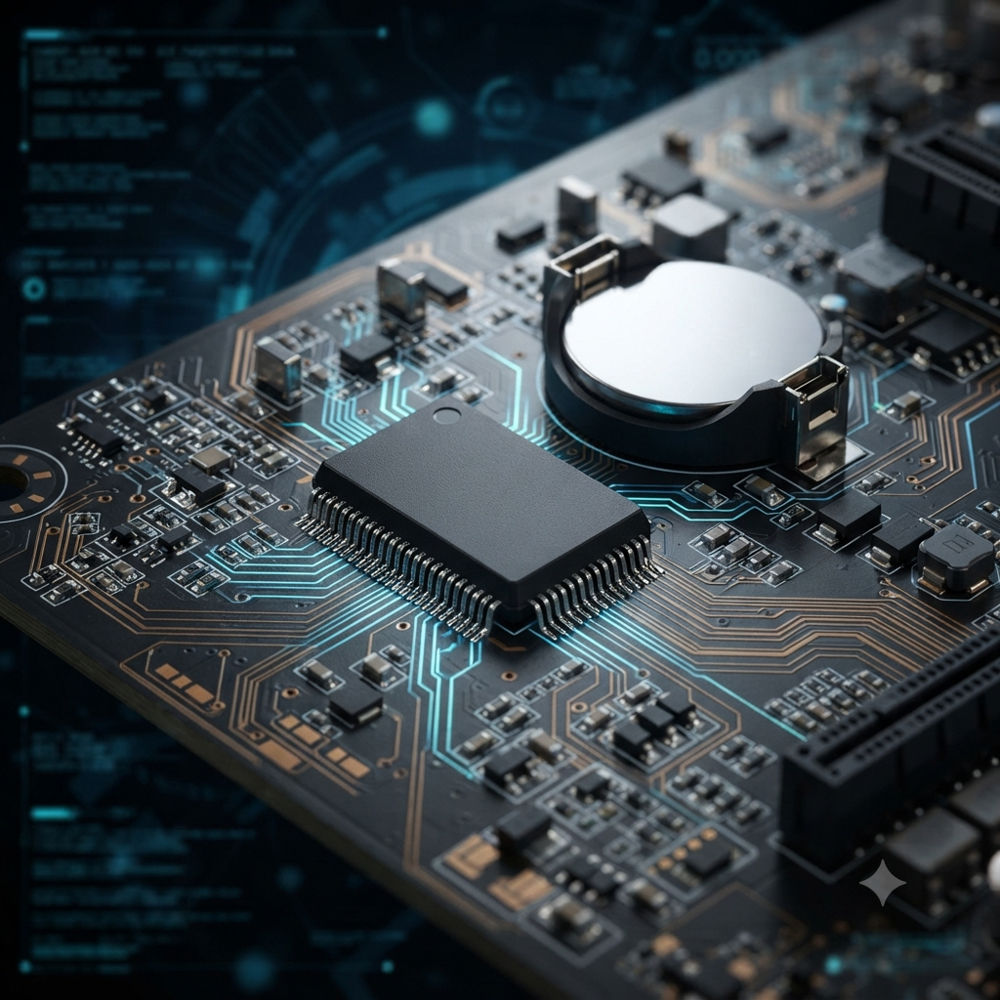
<figcaption>Memoria CMOS</figcaption>
</figure>
<figure class="image-card">
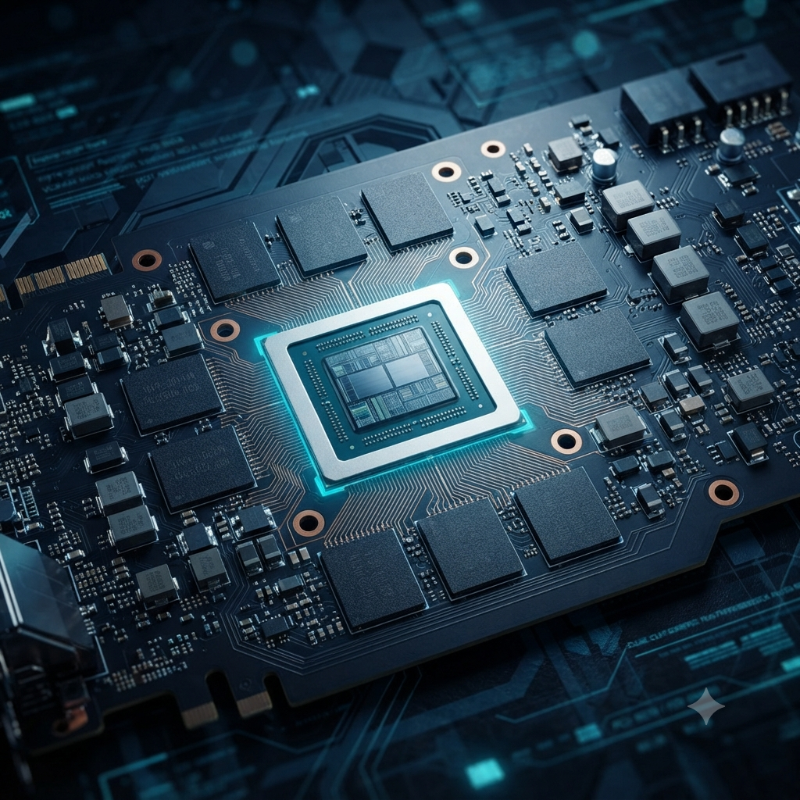
<figcaption>Memoria VRAM</figcaption>
</figure>
</div>

> 🧩 **Cuestionario en Aules:** tras repasar este apartado, realiza el cuestionario **«HW-05 Tipos de memoria»** en Aules. Las preguntas son aleatorias y se guardará tu mejor nota.

---

## 6 · Sistemas de refrigeración

Los componentes electrónicos **generan calor**. Si la temperatura aumenta demasiado, el rendimiento disminuye y pueden producirse averías.

### 6.1 · Ventilador

El **ventilador** genera un flujo constante de aire para reducir la temperatura.

- **Función:** evitar el sobrecalentamiento de los componentes.
- **Ubicación:** en la CPU, la GPU o la carcasa del equipo.
- **Curiosidad:** algunos ventiladores modifican automáticamente su velocidad según la temperatura.

> 🏥 **Aplicación en entornos sanitarios:** permite que los equipos funcionen durante jornadas completas sin problemas de temperatura.

> ❓ **Pregunta para reflexionar:** ¿qué podría suceder si el ventilador deja de funcionar correctamente?
> **Respuesta orientativa:** el equipo podría sobrecalentarse, reducir su rendimiento o apagarse automáticamente.

### 6.2 · Disipador térmico

El **disipador** es una pieza metálica diseñada para **absorber y dispersar el calor**.

- **Función:** extraer el calor generado por la CPU o la GPU.
- **Ubicación:** directamente sobre el procesador o la tarjeta gráfica.
- **Curiosidad:** suele fabricarse en aluminio o cobre, excelentes conductores térmicos.

> 🏥 **Aplicación en entornos sanitarios:** contribuye al funcionamiento estable de los sistemas que gestionan información sanitaria crítica.

> 📌 **Resumen:** ventilador (mueve el aire) + disipador (absorbe el calor): juntos evitan el sobrecalentamiento y protegen los componentes.

<div class="image-grid image-grid--2">
<figure class="image-card">
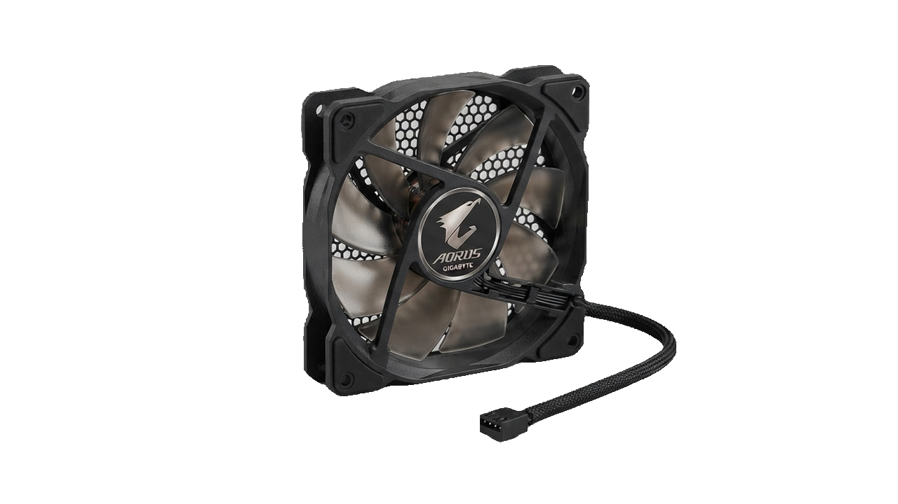
<figcaption>Ventilador</figcaption>
</figure>
<figure class="image-card">
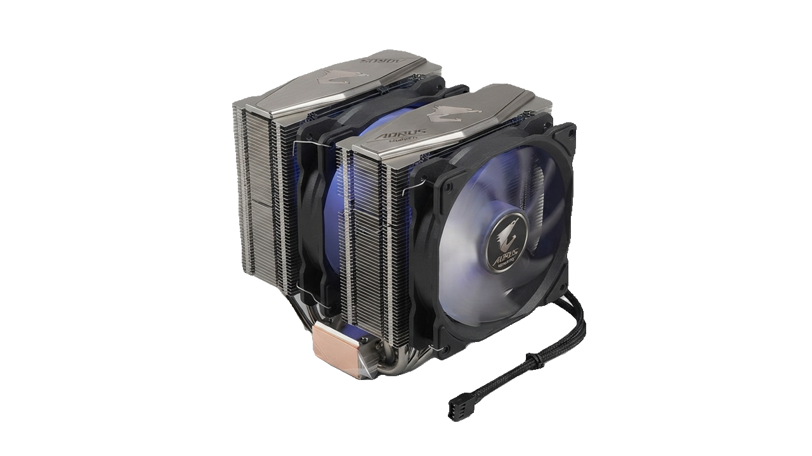
<figcaption>Disipador térmico</figcaption>
</figure>
</div>

> 🧩 **Cuestionario en Aules:** tras repasar este apartado, realiza el cuestionario **«HW-06 Sistemas de refrigeración»** en Aules. Las preguntas son aleatorias y se guardará tu mejor nota.

---

## 7 · Periféricos

Los **periféricos** son dispositivos externos que se conectan al ordenador para **introducir información, mostrar resultados o intercambiar datos** con otros sistemas.

> 🏥 **Aplicación en entornos sanitarios:** registrar datos de pacientes, digitalizar documentación, imprimir informes médicos, participar en videoconferencias o identificar usuarios mediante tarjetas sanitarias.

Se clasifican según su función en **entrada**, **salida** y **entrada/salida**.

### 7.1 · Hardware de entrada

Permiten **introducir información** en el ordenador.

| Periférico | Función | Aplicación sanitaria |
|:--|:--|:--|
| **Teclado** | Escribir texto, números y comandos | Introducir datos de pacientes, redactar informes y gestionar citas |
| **Ratón** | Mover el puntero, seleccionar y ejecutar | Navegar por historias clínicas electrónicas y agendas |
| **Escáner** | Digitalizar documentos físicos | Consentimientos informados, informes, solicitudes y pruebas |
| **Lector de tarjetas sanitarias** | Identificar usuarios | Identificar de forma segura a pacientes y profesionales |
| **Micrófono** | Capturar sonido | Videoconferencias, telemedicina y sistemas de dictado |

> 💡 **Idea clave:** «entrada» = la información viaja desde el usuario hacia el ordenador.

### 7.2 · Hardware de salida

**Muestran o transmiten** la información procesada por el ordenador.

| Periférico | Función | Aplicación sanitaria |
|:--|:--|:--|
| **Monitor** | Mostrar visualmente la información | Consultar historias clínicas y visualizar informes |
| **Impresora** | Producir copias físicas | Recetas, informes médicos, etiquetas y listados |
| **Altavoces** | Reproducir sonido | Videoconferencias, formación online y multimedia |
| **Proyector** | Proyectar imágenes a gran tamaño | Sesiones de formación y reuniones clínicas |

> 💡 **Idea clave:** «salida» = la información viaja desde el ordenador hacia el usuario.

### 7.3 · Hardware de entrada/salida

Capaces tanto de **recibir como de enviar** información.

| Periférico | Función | Aplicación sanitaria |
|:--|:--|:--|
| **Pantalla táctil** | Mostrar y recibir acciones con el tacto | Mostradores de atención al público y autoservicio |
| **Impresora multifunción** | Imprimir, escanear y a veces enviar fax | Gestionar documentación con un único equipo |
| **USB y discos duros externos** | Guardar y trasladar archivos | Copias de seguridad e intercambio de documentación |

> 💡 **Idea clave:** «entrada/salida» = el dispositivo hace ambas cosas, como una pantalla táctil.

> ❓ **Pregunta para reflexionar:** ¿por qué es importante proteger correctamente los dispositivos de almacenamiento portátiles?
> **Respuesta orientativa:** porque pueden contener información sensible cuya pérdida o acceso no autorizado podría comprometer la seguridad de los datos.

> 📌 **Resumen:** entrada (teclado, ratón, escáner…), salida (monitor, impresora…), entrada/salida (pantalla táctil, multifunción, USB).

<div class="image-grid">
<figure class="image-card">
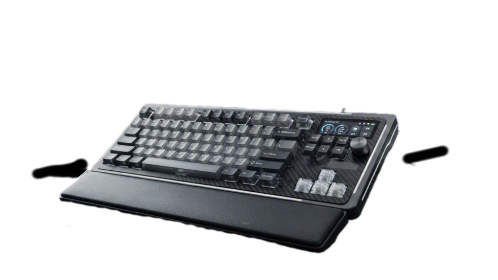
<figcaption>Teclado · entrada</figcaption>
</figure>
<figure class="image-card">
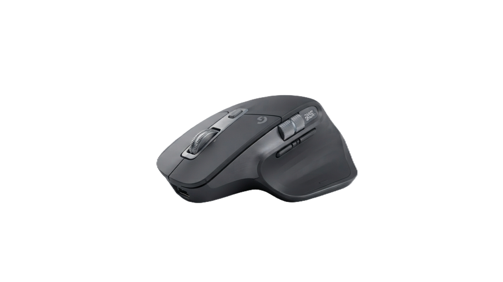
<figcaption>Ratón · entrada</figcaption>
</figure>
<figure class="image-card">
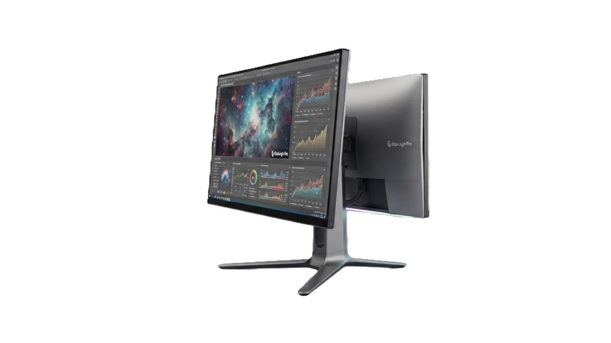
<figcaption>Monitor · salida</figcaption>
</figure>
<figure class="image-card">
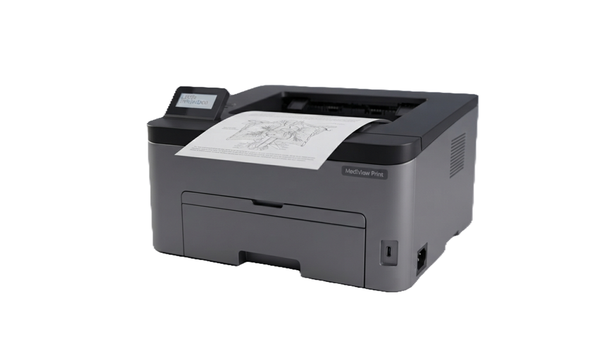
<figcaption>Impresora · salida</figcaption>
</figure>
<figure class="image-card">
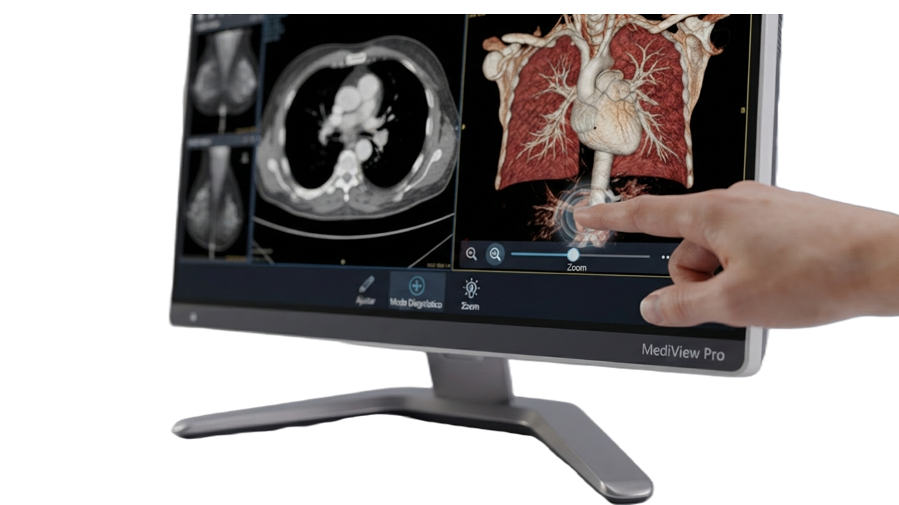
<figcaption>Pantalla táctil · entrada/salida</figcaption>
</figure>
<figure class="image-card">
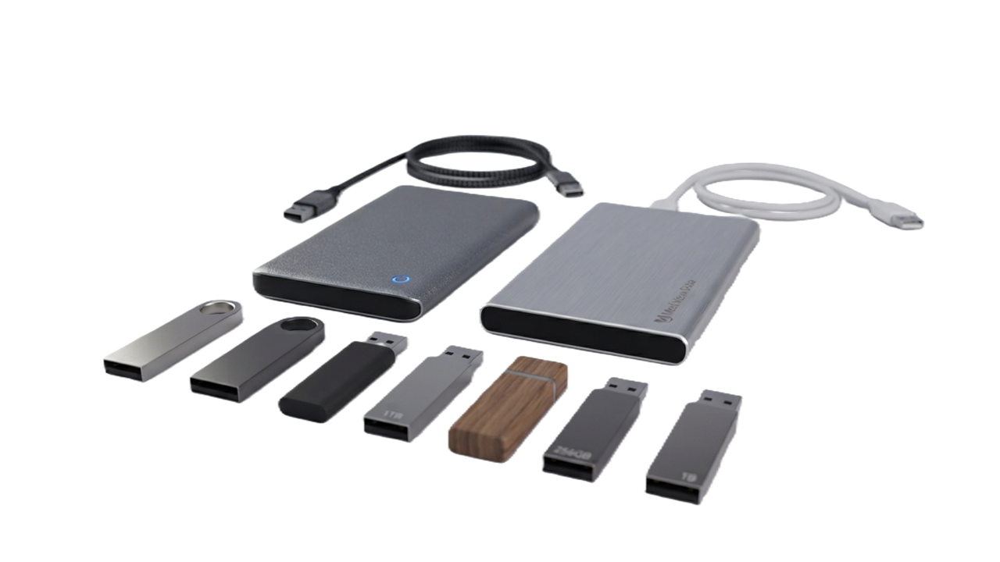
<figcaption>Almacenamiento portátil · entrada/salida</figcaption>
</figure>
</div>

> 🧩 **Cuestionario en Aules:** tras repasar este apartado, realiza el cuestionario **«HW-07 Periféricos»** en Aules. Las preguntas son aleatorias y se guardará tu mejor nota.

---

## 8 · Puertos de comunicación

Los **puertos de comunicación** son interfaces físicas que permiten **conectar dispositivos externos** al ordenador para intercambiar información, transmitir audio o vídeo, acceder a redes o suministrar energía.

> 💡 **Idea clave:** conocer los puertos es fundamental para el mantenimiento y el uso correcto de los equipos, especialmente en entornos profesionales como el sanitario.

### 8.1 · Puertos de datos

| Puerto | Descripción | Aplicación sanitaria |
|:--|:--|:--|
| **USB-A** | Conector USB tradicional rectangular | Teclados, ratones, impresoras, lectores de tarjetas y memorias USB |
| **USB-B** | Conector cuadrado de impresoras y escáneres | Conexión de impresoras y escáneres de documentación clínica |
| **USB-C** | Conector moderno, reversible y pequeño | Portátiles modernos y dispositivos móviles corporativos |
| **Thunderbolt** | Alta velocidad, mismo conector que USB-C | Estaciones de trabajo y sistemas de diagnóstico por imagen |

### 8.2 · Puertos de red

| Puerto | Descripción | Aplicación sanitaria |
|:--|:--|:--|
| **RJ45 (Ethernet)** | Conector para cable de red local | Acceso a historias clínicas, bases de datos y aplicaciones corporativas |

### 8.3 · Puertos de vídeo

| Puerto | Descripción | Aplicación sanitaria |
|:--|:--|:--|
| **HDMI** | Vídeo y audio de alta calidad en un cable | Monitores clínicos, proyectores y pantallas de formación |
| **DisplayPort** | Interfaz digital para alta resolución | Estaciones de radiología y diagnóstico por imagen |
| **DVI** | Vídeo digital anterior a HDMI | Todavía presente en algunos equipos antiguos |

### 8.4 · Puertos de audio

| Puerto | Descripción | Aplicación sanitaria |
|:--|:--|:--|
| **Jack 3,5 mm** | Conector analógico para auriculares, micrófonos y altavoces | Videoconferencias, telemedicina y sistemas multimedia |

### 8.5 · Puertos históricos o en desuso

Conocerlos ayuda a identificar **equipos heredados** y a comprender la evolución del hardware.

| Puerto | Uso histórico | Situación actual |
|:--|:--|:--|
| **FireWire (IEEE 1394)** | Transferencia rápida de vídeo digital | Sustituido por USB 3.x y Thunderbolt |
| **eSATA** | Almacenamiento externo a gran velocidad | Sustituido por USB 3.x y USB-C |
| **VGA** | Vídeo analógico a monitor | Obsoleto, sustituido por HDMI y DisplayPort |
| **PS/2** | Teclados (morado) y ratones (verde) | Sustituido por USB |

> ❓ **Pregunta para reflexionar:** ¿por qué crees que algunos puertos han desaparecido y han sido sustituidos?
> **Respuesta orientativa:** porque las nuevas tecnologías ofrecen mayores velocidades, más funcionalidades, mejor compatibilidad y diseños más sencillos y versátiles.

> 📌 **Resumen:** datos (USB-A/B/C, Thunderbolt), red (RJ45), vídeo (HDMI, DisplayPort, DVI), audio (Jack) e históricos (FireWire, eSATA, VGA, PS/2).

<div class="image-grid">
<figure class="image-card">
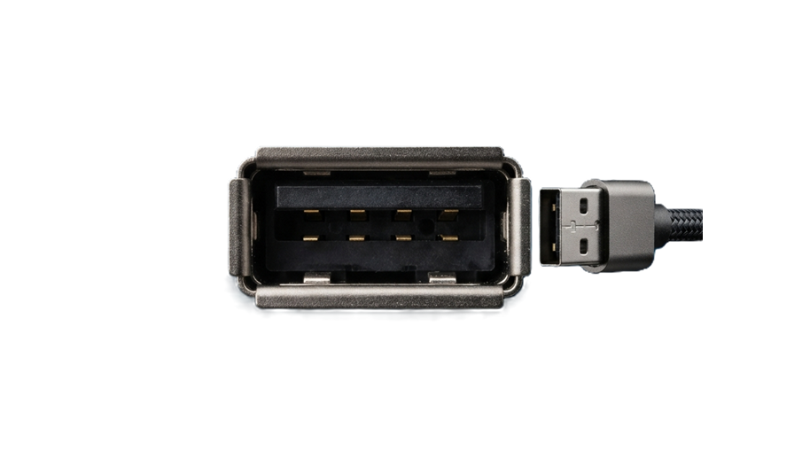
<figcaption>USB-A · datos</figcaption>
</figure>
<figure class="image-card">
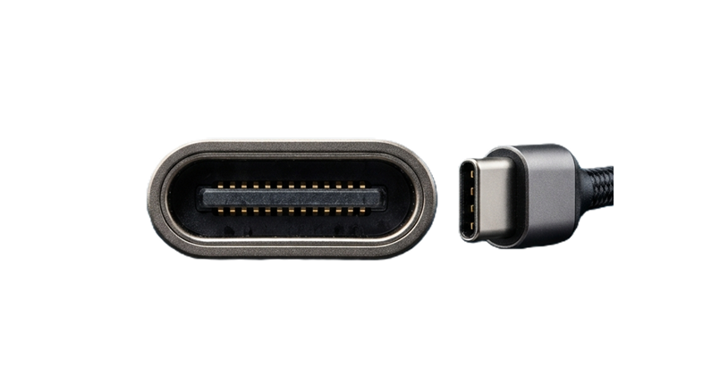
<figcaption>USB-C · datos</figcaption>
</figure>
<figure class="image-card">
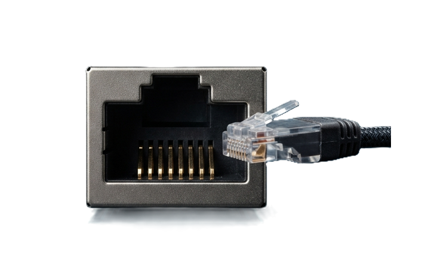
<figcaption>RJ45 (Ethernet) · red</figcaption>
</figure>
<figure class="image-card">
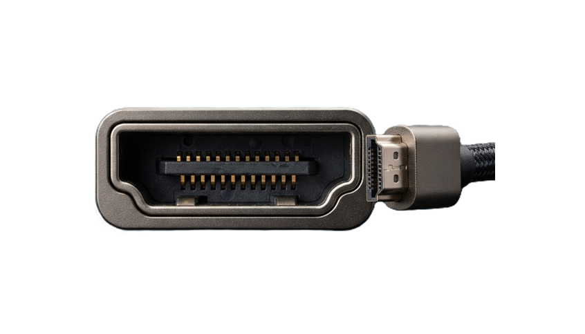
<figcaption>HDMI · vídeo</figcaption>
</figure>
</div>

> 🧩 **Cuestionario en Aules:** tras repasar este apartado, realiza el cuestionario **«HW-08 Puertos de comunicación»** en Aules. Las preguntas son aleatorias y se guardará tu mejor nota.

---

## 9 · Mapa conceptual del hardware

Así se organiza todo lo estudiado en este bloque:

```
HARDWARE
├── Componentes esenciales → Placa base · Fuente de alimentación
├── Hardware de procesamiento → CPU · GPU
├── Hardware de almacenamiento → HDD · SSD
├── Tipos de memoria → RAM · ROM · Caché · Virtual · Flash · CMOS · VRAM
├── Sistemas de refrigeración → Ventilador · Disipador térmico
├── Periféricos
│   ├── Entrada → Teclado · Ratón · Escáner · Lector de tarjetas · Micrófono
│   ├── Salida → Monitor · Impresora · Altavoces · Proyector
│   └── Entrada/Salida → Pantalla táctil · Multifunción · USB/Disco externo
└── Puertos de comunicación
    ├── Datos → USB-A · USB-B · USB-C · Thunderbolt
    ├── Red → RJ45
    ├── Vídeo → HDMI · DisplayPort · DVI
    ├── Audio → Jack 3,5 mm
    └── Históricos → FireWire · eSATA · VGA · PS/2
```

> 💡 **Idea clave:** una sola página que conecta todos los conceptos del bloque: repásala antes del cuestionario final.

<figure class="image-figure image-figure--wide">
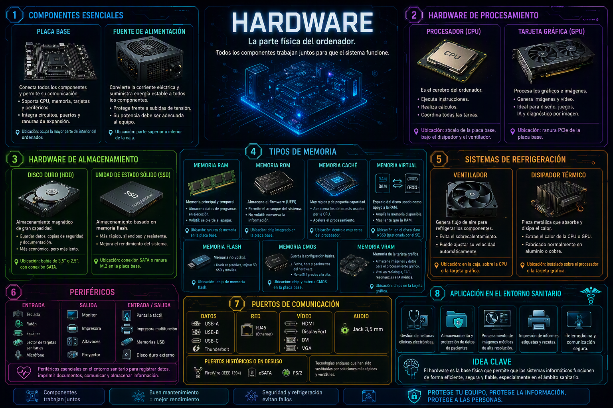
<figcaption>Clasificación general del hardware estudiado en el bloque.</figcaption>
</figure>

---

## 10 · Resumen del bloque

- El **hardware** es todo lo físico y tangible de un sistema informático.
- **Componentes esenciales:** placa base y fuente de alimentación.
- **Procesamiento:** CPU (cerebro) y GPU (imágenes).
- **Almacenamiento:** HDD (espacio) y SSD (velocidad).
- **Memorias:** RAM (trabajo), ROM (arranque), caché (velocidad), virtual (apoyo), flash/CMOS/VRAM (funciones específicas).
- **Refrigeración:** ventilador y disipador evitan el sobrecalentamiento.
- **Periféricos:** de entrada, de salida y de entrada/salida.
- **Puertos:** datos, red, vídeo, audio e históricos.

> 🏥 **Aplicación en entornos sanitarios:** todos los días trabajas con estos elementos en admisión, consultas, laboratorios y archivo. Comprenderlos permite mantener los equipos y evitar o resolver incidencias.

> 🧩 **Cuestionario final del bloque:** realiza el cuestionario **«HW-EXAMEN Hardware»** en Aules. Combina preguntas aleatorias de todos los apartados del bloque y se guardará tu mejor nota hasta la fecha de cierre.

> 🧰 **Bloque práctico:** cuando completes el cuestionario, trabaja el [**Bloque práctico: Hardware básico de un puesto de trabajo administrativo sanitario**](../practico-hardware/index.html): reconocimiento de equipos y periféricos, puertos y conexiones, verificación del puesto e inventario, con actividades autocorregibles y soluciones descargables.

---

## Créditos

Material Moodle bilingüe de Vibecoding · HTML generado desde Markdown · CC BY-SA 4.0

Módulo de Ofimática · UP01 Mantenimiento básico de equipos · CFGS Documentación y Administración Sanitarias
Autora de los contenidos originales: Noemí Celaya Mingot.