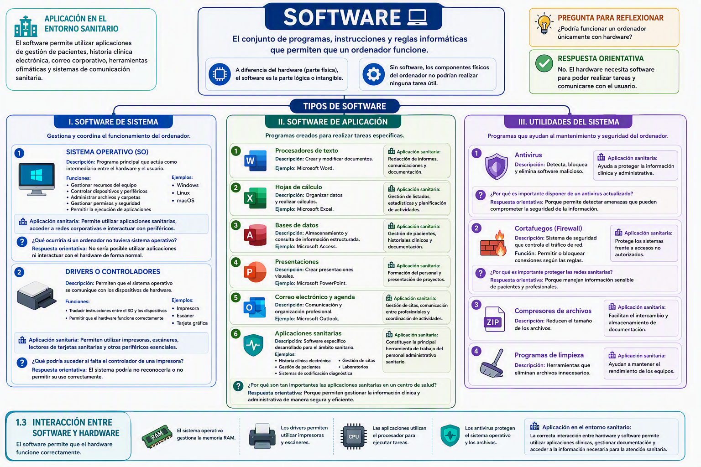

# Bloque 02 · Elementos de software

**UP01 · Mantenimiento básico de equipos**
Módulo de Ofimática · CFGS Documentación y Administración Sanitarias

---

## 1 · ¿Qué es el software?

El **software** es el conjunto de **programas, instrucciones y reglas informáticas** que permiten que un ordenador funcione.

A diferencia del hardware, que corresponde a la parte **física** del sistema, el software es la parte **lógica o intangible**. Sin software, los componentes físicos del ordenador no podrían realizar ninguna tarea útil.

> 💡 **Idea clave:** si no se puede tocar pero permite que el ordenador haga algo útil, es software. Es la parte lógica del sistema informático.

> 🏥 **Aplicación en entornos sanitarios:** el software permite utilizar aplicaciones de gestión de pacientes, historia clínica electrónica, correo corporativo, herramientas ofimáticas y sistemas de comunicación sanitaria.

> ✍️ **Ejemplo práctico:** la historia clínica electrónica, el programa de gestión de citas y el procesador de textos con el que se redacta un informe son software.

> ❓ **Pregunta para reflexionar:** ¿podría funcionar un ordenador únicamente con hardware?
> **Respuesta orientativa:** no. El hardware necesita software para realizar tareas y comunicarse con el usuario.

> 📌 **Resumen:** hardware = parte física; software = parte lógica (programas e instrucciones). Ambos necesitan funcionar juntos.

---

## 2 · Tipos de software

El software puede clasificarse en tres grandes grupos:

- **Software de sistema.**
- **Software de aplicación.**
- **Utilidades del sistema.**

### 2.1 · Software de sistema

Es el software encargado de **gestionar y coordinar el funcionamiento del ordenador**.

#### Sistema operativo (SO)

Es el **programa principal** del ordenador y actúa como **intermediario entre el hardware y el usuario**.

- **Función:** gestionar los recursos del equipo, controlar dispositivos y periféricos, administrar archivos y carpetas, gestionar permisos y seguridad, y permitir la ejecución de aplicaciones.
- **Ejemplos:** Microsoft Windows, Linux y macOS.

> 🏥 **Aplicación en entornos sanitarios:** permite utilizar aplicaciones sanitarias, acceder a redes corporativas e interactuar con los periféricos del sistema.

> ❓ **Pregunta para reflexionar:** ¿qué ocurriría si un ordenador no tuviera sistema operativo?
> **Respuesta orientativa:** no sería posible utilizar aplicaciones ni interactuar con el hardware de forma normal.

#### Drivers o controladores

Son **programas que permiten que el sistema operativo se comunique con los dispositivos de hardware**.

- **Función:** traducir las instrucciones entre el sistema operativo y los dispositivos, y permitir que el hardware funcione correctamente.
- **Ejemplos:** controlador de impresora, de escáner y de tarjeta gráfica.

> 🏥 **Aplicación en entornos sanitarios:** permiten utilizar impresoras, escáneres, lectores de tarjetas sanitarias y otros periféricos esenciales.

> ❓ **Pregunta para reflexionar:** ¿qué podría suceder si falta el controlador de una impresora?
> **Respuesta orientativa:** el sistema operativo podría no reconocerla o no permitir su uso correctamente.

> 📌 **Resumen:** el sistema operativo (gestiona el equipo) y los drivers (comunican el sistema con el hardware) forman el software de sistema.

### 2.2 · Software de aplicación

Son **programas creados para realizar tareas específicas**.

| Aplicación | Función | Aplicación sanitaria |
|:--|:--|:--|
| **Procesadores de texto** (Word) | Crear y modificar documentos | Redacción de informes, comunicaciones y documentación administrativa |
| **Hojas de cálculo** (Excel) | Organizar datos y realizar cálculos | Gestión de listados, estadísticas y planificación de actividades |
| **Bases de datos** (Access) | Almacenar y consultar información estructurada | Gestión de pacientes, historiales clínicos y documentación administrativa |
| **Presentaciones** (PowerPoint) | Crear presentaciones visuales | Formación del personal y presentación de proyectos |
| **Correo electrónico y agenda** (Outlook) | Comunicación y organización profesional | Gestión de citas, comunicación entre profesionales y coordinación de actividades |
| **Aplicaciones sanitarias** | Software específico del ámbito sanitario | Historia clínica electrónica, gestión de pacientes, codificación diagnóstica, citas y laboratorios |

> 💡 **Idea clave:** la ofimática (procesador de textos, hoja de cálculo, base de datos, presentaciones y correo) es el software de aplicación más habitual en cualquier puesto administrativo sanitario.

> 🏥 **Aplicación en entornos sanitarios:** las aplicaciones sanitarias constituyen la principal herramienta de trabajo del personal administrativo sanitario.

> ❓ **Pregunta para reflexionar:** ¿por qué son tan importantes las aplicaciones sanitarias en un centro de salud?
> **Respuesta orientativa:** porque permiten gestionar la información clínica y administrativa de manera segura y eficiente.

### 2.3 · Utilidades del sistema

Son **programas que ayudan al mantenimiento y seguridad del ordenador**.

| Utilidad | Función | Aplicación sanitaria |
|:--|:--|:--|
| **Antivirus** | Detectar, bloquear y eliminar software malicioso | Protege la información clínica y administrativa |
| **Cortafuegos (firewall)** | Controlar el tráfico de red | Protege los sistemas frente a accesos no autorizados |
| **Compresores de archivos** | Reducir el tamaño de los archivos | Facilita el intercambio y almacenamiento de documentación |
| **Programas de limpieza** | Eliminar archivos innecesarios | Ayuda a mantener el rendimiento de los equipos |

> ❓ **Pregunta para reflexionar:** ¿por qué es importante disponer de un antivirus actualizado?
> **Respuesta orientativa:** porque permite detectar amenazas que pueden comprometer la seguridad de la información.

> ❓ **Pregunta para reflexionar:** ¿por qué es importante proteger las redes sanitarias?
> **Respuesta orientativa:** porque manejan información sensible de pacientes y profesionales.

> 📌 **Resumen:** de sistema (SO y drivers), de aplicación (ofimática y aplicaciones sanitarias) y utilidades (antivirus, firewall, compresores y limpieza).

---

## 3 · Interacción entre software y hardware

El **software permite que el hardware funcione correctamente**. Sin programas, los componentes físicos no pueden ejecutar ninguna tarea.

- El **sistema operativo** gestiona la **memoria RAM** y los recursos del equipo.
- Los **drivers** permiten utilizar impresoras, escáneres y otros periféricos.
- Las **aplicaciones** utilizan el **procesador** para ejecutar tareas.
- Los **antivirus** protegen el **sistema operativo** y los **archivos**.

> 🏥 **Aplicación en entornos sanitarios:** la correcta interacción entre hardware y software permite utilizar aplicaciones clínicas, gestionar documentación y acceder a la información necesaria para la atención sanitaria.

> ✍️ **Ejemplo práctico:** para consultar la historia clínica electrónica se necesita el sistema operativo, la aplicación sanitaria y el hardware del puesto (procesador, memoria, pantalla y red).

> ❓ **Pregunta para reflexionar:** si falla el driver de la tarjeta gráfica, ¿qué problema verá el usuario?
> **Respuesta orientativa:** probablemente no se mostrarán correctamente las imágenes en pantalla, afectando a aplicaciones de diagnóstico por imagen.

> 📌 **Resumen:** hardware y software son dos caras del mismo sistema: el software dirige y el hardware ejecuta. Si uno falla, todo el sistema se resiente.

---

## 4 · Organización del software

Así se organiza todo lo estudiado en este bloque:

```
SOFTWARE
├── Software de sistema
│   ├── Sistema operativo (SO) → Windows · Linux · macOS
│   └── Drivers o controladores → Impresora · Escáner · Tarjeta gráfica
├── Software de aplicación
│   ├── Procesadores de texto → Microsoft Word
│   ├── Hojas de cálculo → Microsoft Excel
│   ├── Bases de datos → Microsoft Access
│   ├── Presentaciones → Microsoft PowerPoint
│   ├── Correo electrónico y agenda → Microsoft Outlook
│   └── Aplicaciones sanitarias → Historia clínica · Gestión de pacientes · Citas · Laboratorios
└── Utilidades del sistema
    ├── Antivirus
    ├── Cortafuegos (firewall)
    ├── Compresores de archivos
    └── Programas de limpieza
```

> 💡 **Idea clave:** una sola página que conecta todos los conceptos del bloque: repásala antes del cuestionario final.

---

## 5 · Resumen del bloque

- El **software** es la parte **lógica** del sistema informático (programas e instrucciones).
- **Software de sistema:** sistema operativo (Windows, Linux, macOS) y drivers o controladores.
- **Software de aplicación:** procesadores de texto, hojas de cálculo, bases de datos, presentaciones, correo y agenda, y aplicaciones sanitarias.
- **Utilidades del sistema:** antivirus, cortafuegos, compresores de archivos y programas de limpieza.
- **Interacción:** el software permite que el hardware funcione correctamente; ambos se necesitan.

> 🏥 **Aplicación en entornos sanitarios:** día a día trabajas con el sistema operativo, la ofimática y las aplicaciones sanitarias. Comprender qué es cada tipo de software permite mantener los equipos, instalar y actualizar programas y resolver o comunicar incidencias.

> 🧩 **Cuestionario final del bloque:** accede a [**Cuestionario_1_1_Software**](https://aules.edu.gva.es/fp/mod/quiz/view.php?id=11402081) y contesta a las preguntas relacionadas con estos contenidos. Hazlo tantas veces como quieras antes de que finalice el plazo, se guardará tu mejor nota. Cuando lo hayas completado, continúa con el siguiente elemento: [**Bloque práctico de software**](../practico-software/index.html).

<figure class="image-figure image-figure--wide">
  
  <figcaption>Mapa mental del software: esquema de todo lo estudiado en el bloque.</figcaption>
</figure>

> 🧰 **Bloque práctico:** cuando completes el cuestionario, trabaja el [**Bloque práctico: Software y configuración básica de un puesto de trabajo administrativo sanitario**](../practico-software/index.html): identificación de software y hardware, sistema operativo y sus funciones, y personalización básica del sistema, con actividades autocorregibles y soluciones descargables.

---

## Créditos

Material para el módulo de Ofimática. Creado por Noemí Celaya Mingot con ayuda de la IA. Licencia CC BY-NC-SA 4.0

Módulo de Ofimática · UP01 Mantenimiento básico de equipos · CFGS Documentación y Administración Sanitarias
Autora de los contenidos originales: Noemí Celaya Mingot.